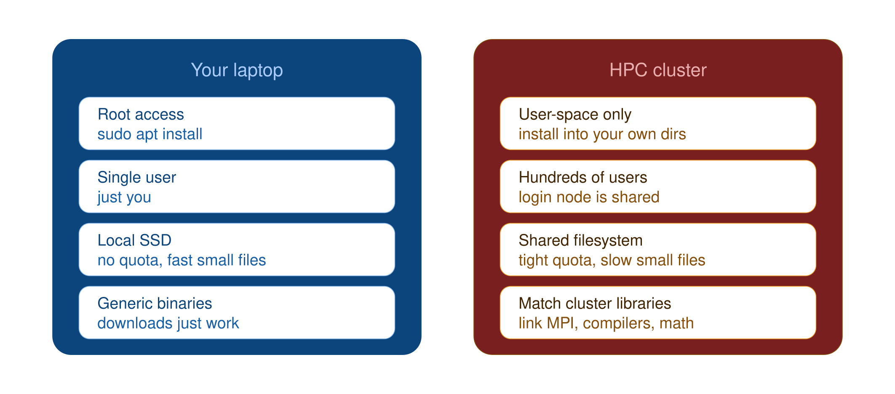
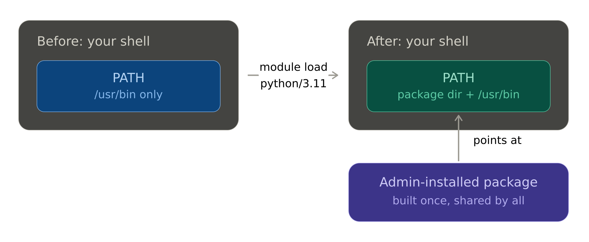
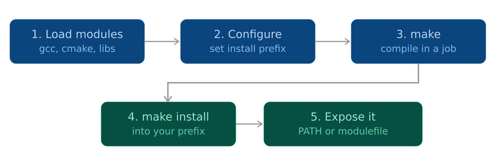
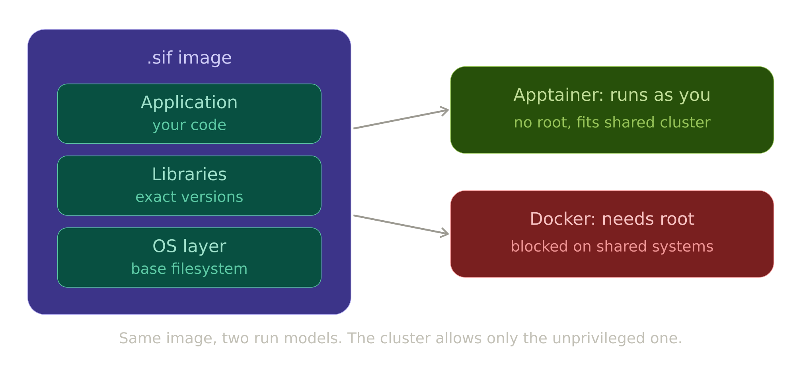
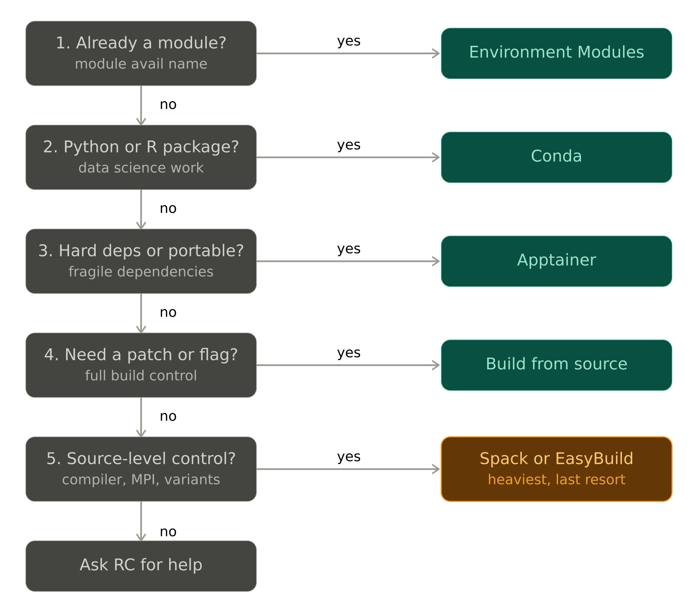

# Research Computing Training

## Presenter

Ghanghoon "Will" Paik

HPC Performance Engineer

[Research Computing](https://rc.northeastern.edu/research-computing-team/)

## Installing Software on an HPC Cluster

Welcome to the [Research Computing Spring 2026 Training Series](https://rc.northeastern.edu/research-computing-spring-training/)!

During this session, we will walk through the main ways to get research software running on a shared cluster, from grabbing a prebuilt package to compiling from source. We will cover when to reach for each tool, the pitfalls that trip people up on a shared system, and working examples you can run yourself.

Today's Agenda:

[1. Why Software Installation Is Different on HPC](#1-why-software-installation-is-different-on-hpc)  
[2. Environment Modules: What `module load` Actually Does](#2-environment-modules-what-module-load-actually-does)  
[3. Conda: User-Space Package Management](#3-conda-user-space-package-management)  
[4. Spack: Building a Scientific Software Stack](#4-spack-building-a-scientific-software-stack)  
[5. EasyBuild: Reproducible Stack Management](#5-easybuild-reproducible-stack-management)  
[6. Installing from Source and Personal Modulefiles](#6-installing-from-source)  
[7. Apptainer: Containers on HPC](#7-apptainer-containers-on-hpc)  
[8. Choosing the Right Tool](#8-choosing-the-right-tool)  
[9. Summary and Resources](#9-summary-and-resources)  

Sample files used in this session are available at **[
Software-Installation-on-HPC-2026
](https://github.com/northeastern-rc-training/Intro-to-Software-Installation-2026)**

---

## 1. Why Software Installation Is Different on HPC

On your laptop you have root access, one user, and a package manager that installs to system directories. None of that holds on a shared cluster. Understanding why changes how you approach every tool in this workshop.

### No root access

You cannot run `sudo apt install` or `yum install`. The system directories are owned by administrators and shared by every user. Everything you install goes into your own space (home, scratch, or a project directory).

### The login node is shared

Login nodes are shared by everyone who is connected. Running a long compile or a memory-heavy install there slows the system down for all users. Heavy builds belong in an interactive job or a batch job, not on the login node.

### The shared filesystem

Your home directory is usually a network filesystem (NFS, GPFS, or Lustre) shared across every node. This has two consequences:

- **Quotas are tight.** Conda environments and build trees create tens of thousands of small files and can fill a home quota quickly.
- **Small-file performance is poor.** A parallel filesystem is tuned for large reads and writes, not for the thousands of tiny `import` lookups a Python environment does at startup. This is a real source of slow job launches.

### Compatibility with the system

Software built on the cluster usually needs to link against the cluster's MPI, compilers, and math libraries to perform well and to talk to the scheduler. A generic binary downloaded from the internet often ignores all of this and runs slower, or fails to launch across nodes.

### The mental model

| Your laptop | HPC cluster |
|---|---|
| Root access | User-space only |
| Single user | Hundreds of shared users |
| Local SSD | Shared network filesystem with quotas |
| One OS package manager | Modules, Conda, Spack, EasyBuild, containers |
| Generic binaries are fine | Builds should match cluster libraries |



---

## 2. Environment Modules: What `module load` Actually Does

Before installing anything, check whether the software already exists. Most clusters expose preinstalled software through **environment modules**. This cluster uses the classic Tcl-based **Environment Modules** system (the `module` command), not Lmod, so a few commands differ from what you may see in other tutorials.

A module does not install software. It edits your shell environment (`PATH`, `LD_LIBRARY_PATH`, and similar) so the shell can find a package that an administrator already built. Loading and unloading modules is how you switch between versions cleanly without conflicts.

### Core commands

```bash
module avail                # list all available modules
module avail miniconda3     # list modules whose name starts with miniconda3
module show miniconda3      # show what a module changes in your environment
module load python/3.13.5   # add a package to your environment
module list                 # show what is currently loaded
module unload python/3.13.5 # remove it
module purge                # clear everything
```

### Why this matters before you install anything

The fastest install is the one you do not have to do. If `module avail` shows what you need, use it. If you need a compiler or MPI to build something yourself (Sections 4 to 6), you load those as modules first so your build links against the cluster's optimized libraries.

> The exact module names and versions are cluster-specific. The commands below assume Northeastern's Discovery/Explorer environment. Verify current module names with `module avail` before presenting.



---

## 3. Conda: User-Space Package Management

Conda is the most common starting point for researchers, especially in Python and R. It installs into your own directory, manages dependencies including non-Python libraries, and needs no root access. That is exactly why it fits HPC.

It is also the most commonly misused tool on a cluster, so this section spends time on the pitfalls as much as the commands.

### 3.1 Basic Workflow

On most clusters you load a Conda module rather than installing Conda yourself.

```bash
module load miniconda3

conda create -n myenv python=3.11 numpy scipy
source activate myenv           # or: conda activate myenv
python -c "import numpy; print(numpy.__version__)"
```

### 3.2 Channels

A channel is a repository that Conda pulls packages from. The community **conda-forge** channel has far broader and more current coverage than Anaconda's default channels, and it is the right default for most research work.

There is also a licensing reason to prefer it. Anaconda's terms of service restrict use of the default channels (the `defaults` channel and `repo.anaconda.com`) for large organizations, and many universities now avoid them to stay compliant. The safe approach is to use conda-forge and remove the defaults channel entirely:

```bash
conda config --add channels conda-forge
conda config --remove channels defaults
```

### 3.3 The HPC Pitfalls

This is the part people skip and then file a help ticket about.

**Do not run installs on the login node.** Solving an environment is CPU and memory heavy. Use an interactive job:

```bash
srun --partition=short --cpus-per-task=4 --mem=8G --pty bash
# then run your conda create / conda install here
```

**Watch your home quota.** Conda environments are tens of thousands of small files and can fill a home quota quickly. Be deliberate about where environments live. Do not put them on scratch: scratch is periodically purged, so environments stored there will disappear, sometimes mid-project. Keep environments in persistent space (home, or a project/work directory with enough quota). The package cache, which is regenerable, is the one piece you can safely redirect to scratch to save quota:

```bash
# in ~/.condarc, redirect only the regenerable package cache
pkgs_dirs:
  - /scratch/$USER/conda/pkgs
```

If home quota is tight, create environments in a persistent project directory with `conda create -p /projects/proj_name/envs/myenv` rather than relocating all environments to scratch.

Alternatively, you may regularly empty the pkgs directory:
```bash
rm -rf ~/.conda/pkgs
```

**Activate inside your job script, not your `.bashrc`.** Auto-activating an environment in `.bashrc` slows every login and can break batch jobs. 

Commenting out or removing conda generated lines is recommended:
```bash
Inside .bashrc:

# >>> conda initialize >>>
# !! Contents within this block are managed by 'conda init' !!
#__conda_setup="$('/opt/conda/bin/conda' 'shell.bash' 'hook' 2> /dev/null)"
#if [ $? -eq 0 ]; then
#    eval "$__conda_setup"
#else
#    if [ -f "/opt/conda/etc/profile.d/conda.sh" ]; then
#        . "/opt/conda/etc/profile.d/conda.sh"
#    else
#        export PATH="/opt/conda/bin:$PATH"
#    fi
#fi
#unset __conda_setup
# <<< conda initialize <<<
```

Activate explicitly in the job:

```bash
#SBATCH -N 1
#SBATCH --cpus-per-task=4

module load miniconda3
source activate myenv
python my_analysis.py
```

**Pin and export your environment for reproducibility:**

```bash
conda env export > environment.yml          # exact, includes builds
conda env create -f environment.yml         # recreate later
```

---

## 4. Spack: Building a Scientific Software Stack

Spack is a package manager built for HPC. Unlike Conda, it builds packages **from source** by default and lets you control the compiler, the MPI implementation, and build options. It can hold many versions and build variants side by side without conflict.

> A note on Spack and EasyBuild (this whole section and the next). These are powerful but heavy tools. They build everything from source, which means long compile times, large disk footprints, and real maintenance effort to keep an installation working over time. For most users they are not the first thing to reach for. If a module exists or Conda covers your needs, use those. Spack and EasyBuild make sense when you specifically need source-level control over the compiler, MPI, or build options and you are willing to take on the upkeep. Treat the two sections that follow as "here is the route if you decide to take it," not as a default recommendation.

### 4.1 The Core Idea: the Spec

Spack describes every build with a **spec**. A spec captures the package, version, compiler, and options so a build is fully specified and reproducible.

```bash
# package @version %compiler +variant
hdf5 @1.14.3 %gcc@12.2.0 +mpi
```

The `+mpi` variant means "build with MPI support." Spack resolves the full dependency tree and builds each piece with the compiler and options you asked for.

> The version numbers in the examples throughout Sections 4 to 6 (package versions, compiler versions, toolchain names) are illustrative. They will not match what is actually available on the cluster. Always check the live versions before building, for example with `spack info <package>` or `module avail gcc`.

### 4.2 Basic Workflow

```bash
git clone -c feature.manyFiles=true https://github.com/spack/spack.git
. spack/share/spack/setup-env.sh    # load Spack into your shell

spack list hdf5                      # search
spack info hdf5                      # show versions and variants
spack install hdf5 +mpi              # build it and its dependencies
spack load hdf5                      # add it to your environment
```

> A clean install of a package with many dependencies can take a long time to compile. On a shared cluster, run `spack install` inside a job with several cores, not on the login node.

### 4.3 Spack Environments

A Spack environment groups a set of specs so a project's software is reproducible, similar in spirit to a Conda environment file:

```bash
spack env create myproject
spack env activate myproject
spack add hdf5 +mpi
spack add petsc
spack install                        # build everything in the environment
```

The environment is described by a `spack.yaml` file you can commit to version control and rebuild elsewhere.

---

## 5. EasyBuild: Reproducible Stack Management

EasyBuild solves a similar problem to Spack but with a different philosophy. It is widely used by HPC system administrators to build and maintain the centrally installed software stack, and it integrates tightly with environment modules.

### 5.1 The Core Idea

EasyBuild builds software from recipe files called **easyconfigs** (`.eb`). The important part for a user: you almost never write one. EasyBuild ships with thousands of prebuilt easyconfigs for common scientific software, so in practice you install a package by name from the command line and EasyBuild finds the matching recipe for you. Because the recipe is fixed, two people installing the same package get the same build, which is the reproducibility selling point.

A **toolchain** is a named, versioned bundle of compiler plus MPI plus math libraries (for example `gompi` = GCC + OpenMPI). Everything built on the same toolchain is compatible, and a package name usually includes the toolchain it was built against.

### 5.2 Basic Workflow

There is no EasyBuild module on the cluster, so you install it yourself once into a Conda environment, then use it from there.

```bash
module load miniconda3              # name is cluster-specific; verify

conda create -n easybuild python=3.11
source activate easybuild
pip install easybuild               # one-time install into the env
```

With EasyBuild available in that environment, you install software by name from the command line. First search for an available recipe, then install it:

```bash
source activate easybuild           # activate it each session

eb --search HDF5                    # find prebuilt easyconfigs for HDF5

eb HDF5-1.14.3-gompi-2023a.eb -r \
   --modules-tool=EnvironmentModules \
   --module-syntax=Tcl \
   --installpath=$HOME/easybuild
```

The `--search` step lists the recipe names EasyBuild already knows. You pass one of those names to `eb` and the `-r` flag tells it to build the package and any dependencies it needs. You are not writing a recipe, just naming one that ships with EasyBuild.

Three flags matter on this cluster and are easy to miss:

- `--modules-tool=EnvironmentModules` tells EasyBuild to use the classic Environment Modules system. By default EasyBuild assumes Lmod, which this cluster does not run.
- `--module-syntax=Tcl` writes Tcl modulefiles instead of Lmod's Lua ones. Lua modulefiles will not load here.
- `--installpath=$HOME/easybuild` puts both the builds and the generated modulefiles in your own space, since you cannot write to system directories.

You can put these three in an EasyBuild config file so you do not retype them every build:

```bash
# ~/.config/easybuild/config.cfg
[config]
modules-tool = EnvironmentModules
module-syntax = Tcl
installpath = /home/$USER/easybuild
```

After the build finishes, point `module` at EasyBuild's modulefile directory and load the result:

```bash
module use $HOME/easybuild/modules/all
module load HDF5/1.14.3-gompi-2023a
```

The key detail: EasyBuild's output **is a modulefile**. Once you `module use` its directory, you load the software with `module load` exactly like any preinstalled package, even though EasyBuild itself lives in a Conda environment.

### 5.3 Spack vs EasyBuild

Both build from source and both produce optimized, reproducible installs. The practical differences:

| | Spack | EasyBuild |
|---|---|---|
| How you install | `spack install <spec>` from the command line | `eb <name>.eb` from the command line |
| Dependency handling | Resolves a flexible dependency graph | Follows a fixed toolchain |
| Output | `spack load`, or a module | An environment modulefile |
| Strength | Flexible variants and versions | Strict, repeatable, toolchain-based builds |

> A candid note from experience: neither tool is the recommended first option for most users on this cluster. Both are heavy to set up and genuinely painful to maintain over time, and Spack in particular can be frustrating when builds break or dependencies fail to resolve. If a module or a Conda environment will do the job, that path is far less work. Reach for Spack or EasyBuild only when you specifically need source-level control and have decided the upkeep is worth it.

---

## 6. Installing from Source

Sometimes nothing prebuilt exists, or you need a patch, a specific version, or a build flag none of the package managers expose. Then you compile from source yourself. This is the most manual path and the one where HPC-specific details matter most.

### 6.1 The Standard Build Pattern

Compiled software is built by a **build system**, and the project's documentation (usually a `README` or `INSTALL` file) tells you which one it uses. The two you will meet most often are Autotools and CMake. The language a project is written in does not decide this; both are common across C, C++, and Fortran projects. Always read the project's install instructions first, since they spell out the exact steps and any required flags.

**Autotools (a `configure` script):**

```bash
./configure --prefix=$HOME/software/mytool
make -j 8                            # compile using 8 cores
make install                         # install into the prefix
```

**CMake:**

```bash
module load cmake

cmake -B build -DCMAKE_INSTALL_PREFIX=$HOME/software/mytool
cmake --build build -j 8
cmake --install build
```

Some projects use neither and ship a plain `Makefile` you edit and run with `make`, or their own custom script. The project's instructions are always the source of truth.

### 6.2 The HPC-Specific Details

This is what separates an HPC source build from a laptop build.

**Always set a `--prefix`.** You cannot install to `/usr/local`. Point the install at your own directory, commonly something like `$HOME/software/<tool>/<version>`.

**Load the cluster compiler and libraries first.** Loading `cmake` and any required libraries as modules before you build makes the software link against the cluster's optimized versions. This is the same reason Spack and EasyBuild produce fast binaries.

**Link against the cluster MPI and math libraries.** For parallel or numerical software, point the build at the cluster's MPI and BLAS/LAPACK rather than letting it use a slow generic fallback. The exact flags depend on the project, but the principle is constant.

**Build in a job, not on the login node.** A `make -j 8` is a heavy, multi-core workload. Run it in an interactive job.

### 6.3 Making Your Build Loadable

After installing to a prefix, your shell still does not know the software exists. Add it to your environment manually:

```bash
export PATH=$HOME/software/mytool/bin:$PATH
export LD_LIBRARY_PATH=$HOME/software/mytool/lib:$LD_LIBRARY_PATH
```

For something you will reuse often, exporting these variables by hand every session gets tedious. You can write your own modulefile so a single `module load` does it for you, exactly like the cluster's central software. That is Section 6.4.

### 6.4 Writing Your Own Modulefiles

A modulefile is a small text file that tells the `module` command what to change in your environment. With your own modulefiles, your hand-built software loads and unloads as cleanly as anything the cluster provides, and you can keep several versions side by side without conflicts.

**Step 1: create a directory to hold your modulefiles.**

```bash
mkdir -p $HOME/modulefiles
```

**Step 2: tell `module` where to look.** Register your directory so `module avail` includes it. Add this to your `~/.bashrc` so it persists:

```bash
module use $HOME/modulefiles
```

**Step 3: write a modulefile.** This cluster uses classic Environment Modules, so modulefiles are written in **Tcl**. Create `$HOME/modulefiles/mytool/1.0` with:

```tcl
#%Module
## mytool 1.0 personal modulefile

prepend-path PATH            $HOME/software/mytool/bin
prepend-path LD_LIBRARY_PATH $HOME/software/mytool/lib

module-whatis "mytool 1.0, personal build"
```

The directory name (`mytool`) becomes the module name and the filename (`1.0`) becomes the version. The first line `#%Module` must be present and must be exactly this. It is a marker that identifies the file as a modulefile (the modulefile documentation calls it the "magic cookie," which is just a conventional name for a fixed signature at the start of a file). Without it, the `module` command will not treat the file as valid.

**Step 4: use it like any other module.**

```bash
module avail mytool          # your build now shows up
module load mytool/1.0       # PATH and LD_LIBRARY_PATH are set for you
module unload mytool/1.0     # cleanly reverses everything
```

### 6.5 Building a Personal Module Stack

Once you have one modulefile, the same directory becomes a personal software stack. Each tool gets its own subdirectory, and each version is a file inside it:

```
$HOME/modulefiles/
├── mytool/
│   ├── 1.0
│   └── 2.0
└── otherlib/
    └── 3.4
```

With this layout you can hold `mytool/1.0` and `mytool/2.0` at once and switch between them with a single `module load`, the same way the cluster manages multiple compiler or MPI versions. Two practical extras:

- **Dependencies between your own modules.** A modulefile can pull in others. Adding a `module load gcc/<version>` line inside your modulefile makes the right compiler runtime load alongside your software.
- **Setting a default version.** Create a `.version` file in the tool's directory naming the default, so `module load mytool` (no version) picks the one you intend.

> The Tcl syntax above (`prepend-path`, `module-whatis`, the `#%Module` marker line) is standard for Environment Modules. Confirm the preferred modulefile location and any site-specific naming convention on your cluster before presenting, since some sites expect a particular path or layout.




---

## 7. Apptainer: Containers on HPC

Apptainer (formerly Singularity) brings containers to HPC. A container packages an application with its entire operating-system environment into a single image file, so it runs the same way everywhere. Apptainer is designed for shared clusters, which is why it is used instead of Docker.

### 7.1 Why Not Docker

Docker normally requires root-level privileges to run, which is a security problem on a shared system where you do not have root. Apptainer runs containers as your own user with no elevated privileges, integrates with the scheduler and shared filesystem, and can run GPU and MPI workloads. It can also pull and convert existing Docker images, so you are not locked out of the Docker ecosystem.

### 7.2 Basic Workflow

```bash
# apptainer is installed system-wide; no module load needed

# pull an existing image (including from Docker registries)
apptainer pull lolcow.sif docker://ghcr.io/apptainer/lolcow

# run a command inside the container
apptainer exec lolcow.sif cowsay "Hello from inside a container"

# open an interactive shell inside it
apptainer shell lolcow.sif
```

The `.sif` file is a single image file. You can copy it, archive it, or share it, and it will reproduce the same environment.

### 7.3 Building Your Own Image

**Build images on your own machine, not on the cluster.** Building a `.sif` from scratch generally needs root privileges, which you do not have on a shared system. The standard workflow is to build the image where you do have root (your laptop or a workstation with Apptainer installed) and then copy the finished `.sif` up to the cluster.

You describe an image with a **definition file**:

```bash
# example.def
Bootstrap: docker
From: ubuntu:22.04

%post
    apt-get update && apt-get install -y python3 python3-pip
    pip3 install numpy

%runscript
    python3 "$@"
```

On your local machine, build it:

```bash
# run locally, where you have root
sudo apptainer build example.sif example.def
```

Then copy the image to the cluster and run it there:

```bash
scp example.sif <user>@xfer.discovery.neu.edu:/path/in/your/space/

# then on the cluster:
apptainer exec example.sif python3 my_script.py
```

This keeps the privileged build step on a machine you control and leaves only the unprivileged `run`/`exec` on the cluster, which needs no special permissions.

> If you cannot build locally, ask the Research Computing team about supported alternatives.

### 7.4 When Containers Are the Right Choice

Containers shine when software is hard to install natively: long, fragile dependency chains, conflicting system library versions, or a published image a research group already maintains. They also give you a portable, reproducible artifact you can move between clusters or cite in a paper. The trade-off is image size and the upfront effort of building or finding a good image.



---

## 8. Choosing the Right Tool

There is no single best tool. The right choice depends on what the software is, how reproducible it needs to be, and how much performance matters.

| Tool | Builds from source? | Needs root? | Best for | Main drawback |
|---|---|---|---|---|
| **Environment Modules** | No (preinstalled) | No | Software the cluster already provides | Limited to what admins installed |
| **Conda** | No (prebuilt binaries) | No | Python/R, data science, quick setups | Generic binaries, heavy on quota |
| **Spack** | Yes | No | Source-level control, many variants | Heavy, slow to build, hard to maintain |
| **EasyBuild** | Yes | No | Reproducible toolchain-based builds (mostly admin) | Heavy, less flexible, toolchain-bound |
| **Source install** | Yes | No | Patches, niche tools, full control | Most manual, easiest to get wrong |
| **Apptainer** | N/A (image) | No | Hard dependencies, portability, reproducibility | Build image locally, then copy up |

### A practical decision order

1. **Check for a module first.** `module avail <name>`. The best install is no install.
2. **Python or R package?** Reach for Conda, with the quota and login-node precautions from Section 3.
3. **Need it isolated, portable, or the dependencies are a nightmare?** Build a container image on your own machine and run it on the cluster.
4. **Need a patch, a specific version, or a build flag nothing else exposes?** Build from source.
5. **Need source-level control over compiler, MPI, or variants and willing to maintain it?** Then, and mostly then, Spack or EasyBuild. These are the heaviest option, not the first one.



---

## 9. Summary and Resources

### Key Takeaways

1. **No root, shared filesystem.** Every install goes in your own space, off the login node, and mindful of quota.
2. **Check for a module first.** The fastest install is the one already done for you.
3. **Match the tool to the job.** Conda for Python and R, containers (built locally) for hard dependencies or portability, source builds for full control. Spack and EasyBuild are the heavy, advanced option, not the default.
4. **Build against the cluster's libraries.** Linking to the cluster's compilers, MPI, and math libraries is what makes a build fast and able to scale across nodes.
5. **Make it reproducible.** Export Conda environments, keep your container definition files and `.sif` images, and write modulefiles for your own builds. Future you will be grateful.

### Quick Reference

```bash
# Find existing software
module avail <name>

# Conda (run in a job; keep envs in persistent space, not scratch)
module load miniconda3
conda create -n myenv python=3.11 numpy
source activate myenv

# Spack
. spack/share/spack/setup-env.sh
spack install hdf5 +mpi
spack load hdf5

# EasyBuild (no module; install into a conda env once)
module load miniconda3
conda create -n easybuild python=3.11
source activate easybuild
pip install easybuild
eb HDF5-1.14.3-gompi-2023a.eb -r \
   --modules-tool=EnvironmentModules \
   --module-syntax=Tcl \
   --installpath=$HOME/easybuild
module use $HOME/easybuild/modules/all
module load HDF5/1.14.3-gompi-2023a

# Source build
module load gcc cmake
./configure --prefix=$HOME/software/mytool
make -j 8 && make install

# Personal modulefile (Environment Modules / Tcl)
module use $HOME/modulefiles
# write $HOME/modulefiles/mytool/1.0 with prepend-path lines
module load mytool/1.0

# Apptainer (installed system-wide, no module needed)
# build the image LOCALLY (needs root), then copy the .sif to the cluster
apptainer pull image.sif docker://some/image   # pulling is fine on the cluster
apptainer exec image.sif <command>
```

### Sample Repository

Example definition files, easyconfigs, and environment files referenced today: **[
Software-Installation-on-HPC-2026
](https://github.com/northeastern-rc-training/Intro-to-Software-Installation-2026)**

### Getting Help

Email the Research Computing team at [rchelp@northeastern.edu](mailto:rchelp@northeastern.edu).

Come to [office hours](https://rc.northeastern.edu/getting-help/) hosted on Zoom.

Or [book a consultation](https://rc.northeastern.edu/getting-help/) with an RC team member.

Review our [Documentation](https://rc-docs.northeastern.edu/en/latest/index.html).

Thank you!

---

_For questions or support, contact the Research Computing team at [rchelp@northeastern.edu](mailto:rchelp@northeastern.edu)_
